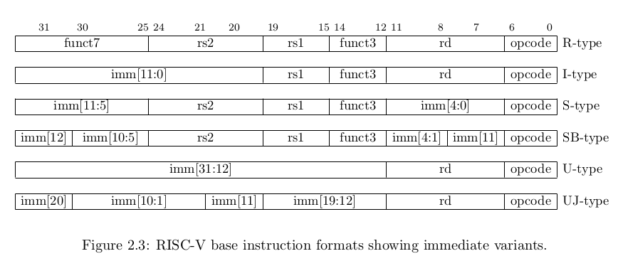
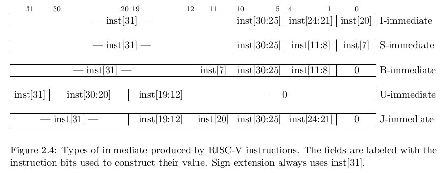

# Instruction Decode (ID) Stage

## Status

✅ Completed

## Overview

The Instruction Decode (ID) stage decodes the fetched RV32I instruction, extracts instruction fields, reads source operands from the register file, and generates immediate values according to the RV32I instruction format.
---

								Instruction Memory
										│
										▼
								+----------------------+
								| Fetch Stage (IF)     |
								+----------------------+
										│
										▼
								+----------------------+
								| Decode Stage (ID)    |
								| • Decode Instruction |
								| • Read Register File |
								| • Generate Immediate |
								+----------------------+
										│
										▼
								+----------------------+
								| Execute Stage (EX)   |
								+----------------------+

## Implemented Features

- Opcode extraction
- Source register extraction (rs1)
- Source register extraction (rs2)
- Destination register extraction (rd)
- funct3 extraction
- funct7 extraction
- Register File (32 × 32-bit)
  - Two asynchronous read ports
  - One synchronous write port
  - x0 register hardwired to zero
- Immediate generation for:
  - I-Type
  - S-Type
  - B-Type
  - U-Type
  - J-Type

---

## Supported RV32I Instruction Formats



| Format | Purpose |
|---------|---------|
| R-Type | Register-register ALU operations |
| I-Type | Immediate ALU operations, Loads, JALR |
| S-Type | Store instructions |
| B-Type | Conditional Branches |
| U-Type | LUI / AUIPC |
| J-Type | JAL |

---

## Immediate Generation

The immediate generator reconstructs immediate values according to the RV32I specification.



Supported immediate types:

- I Immediate
- S Immediate
- B Immediate
- U Immediate
- J Immediate

Sign extension is applied where required.

---

## Opcode Package

The decode stage uses a dedicated package (`risc_pkg.sv`) containing enumerated opcode definitions.

Example:

```systemverilog
typedef enum logic [6:0] {
    OPCODE_R_TYPE  = 7'h33,
    OPCODE_I_LOAD  = 7'h03,
    OPCODE_I_ALU   = 7'h13,
    OPCODE_I_JALR  = 7'h67,
    OPCODE_S_TYPE  = 7'h23,
    OPCODE_B_TYPE  = 7'h63,
    OPCODE_LUI     = 7'h37,
    OPCODE_AUIPC   = 7'h17,
    OPCODE_JAL     = 7'h6F
} opcode_t;
```

---

---

## Register File

The ID stage includes a 32 × 32-bit register file compliant with the RV32I ISA.

### Features

- 32 general-purpose registers (x0–x31)
- Two asynchronous read ports
- One synchronous write port
- Active-low reset
- Register x0 is hardwired to zero and cannot be modified

### Interface

Inputs

- clk
- reset_n
- rs1_addr
- rs2_addr
- rd_addr
- rf_wr_en
- wr_data

Outputs

- rs1_data
- rs2_data

## Outputs

The ID stage generates:

- opcode
- funct3
- funct7
- rs1 address
- rs2 address
- rd address
- rs1 data
- rs2 data
- Immediate
- Instruction type


---

## Next Stage

The decoded instruction is forwarded to the Execute (EX) stage.